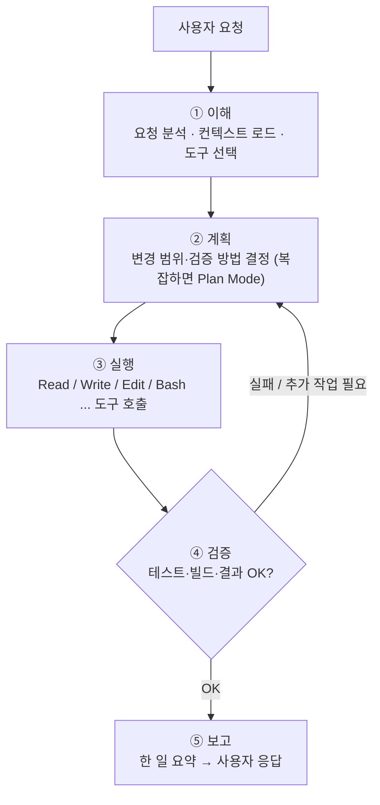
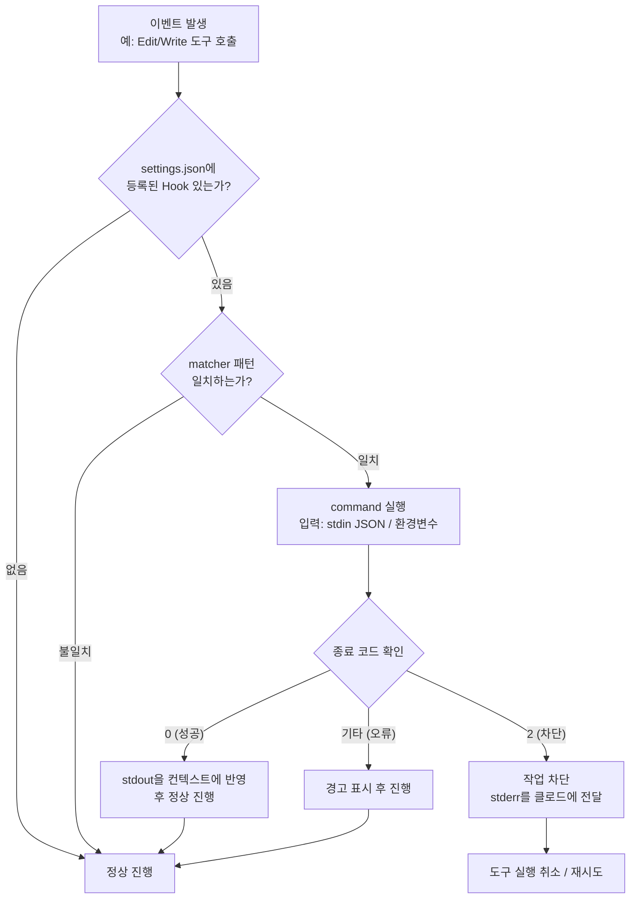
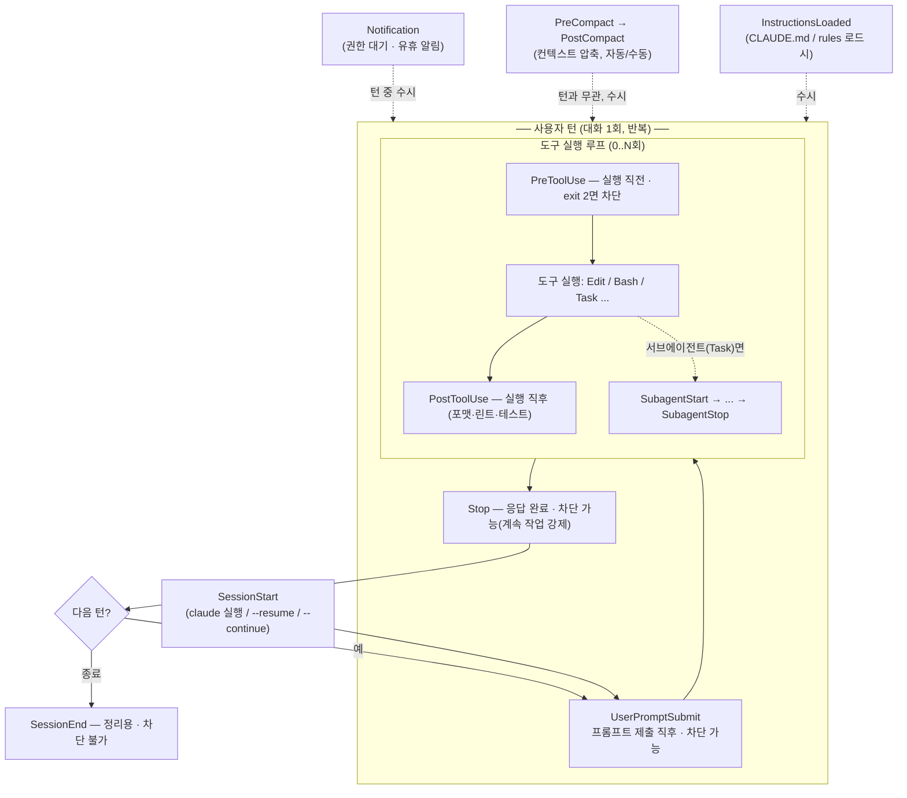

# Chapter 2. 클로드 코드 설치와 환경 구성

Comments : https://code.claude.com/docs/ko/overview#native-install-recommended 참조하는 게 가장 좋은 듯?

> 『클로드 코드 마스터』 학습 노트

---

## 2.1 클로드 코드 개발 환경 설정하기

클로드 코드(Claude Code)는 코드베이스를 읽고, 파일을 편집하고, 명령을 실행하고, 개발 도구와 통합하는 Anthropic의 공식 **에이전트 코딩 도구**입니다. 이제 터미널뿐 아니라 **IDE(VS Code / JetBrains), 데스크톱 앱, 웹 브라우저**에서도 사용할 수 있습니다. 어떤 환경을 쓰든 같은 엔진에 연결되므로 `CLAUDE.md`, 설정, MCP 서버가 모든 환경에서 동일하게 동작합니다.

대부분의 환경에서 **Claude 구독** 또는 **Anthropic Console** 계정이 필요합니다. (Terminal CLI와 VS Code는 일부 타사 제공자도 지원)

> 📌 과거에는 `npm install -g`로 설치했지만, 현재 공식 문서는 **네이티브 설치(Native Install)** 를 권장합니다. 네이티브 설치본은 백그라운드에서 자동 업데이트됩니다.

### 2.1.1 맥에서 클로드 코드 설치하기

**방법 1 — 네이티브 설치 (권장, 자동 업데이트)**:

```bash
# 클로드 코드 설치 (macOS / Linux / WSL 공통)
curl -fsSL https://claude.ai/install.sh | bash

# 설치 확인
claude --version
```

**방법 2 — Homebrew (자동 업데이트 안 됨, 직접 `brew upgrade` 필요)**:

```bash
# 안정 채널 (보통 1주 정도 늦게 반영, 큰 회귀가 있는 릴리스는 건너뜀)
brew install --cask claude-code

# 최신 채널 (출시 즉시 반영)
brew install --cask claude-code@latest

# 업그레이드
brew upgrade claude-code        # 또는 brew upgrade claude-code@latest
```

> Node.js 설치는 더 이상 필수 사전 조건이 아닙니다(네이티브 설치본은 자체 런타임 포함). Agent SDK 등 일부 부가 기능을 쓸 때만 별도로 필요합니다.

### 2.1.2 윈도우에서 클로드 코드 설치하기

```powershell
# Windows PowerShell — 네이티브 설치
irm https://claude.ai/install.ps1 | iex
```

```batch
:: Windows CMD — 네이티브 설치
curl -fsSL https://claude.ai/install.cmd -o install.cmd && install.cmd && del install.cmd
```

```powershell
# WinGet (자동 업데이트 안 됨 — winget upgrade Anthropic.ClaudeCode 로 갱신)
winget install Anthropic.ClaudeCode
```

- `'&&' is not a valid statement separator` 오류 → 지금 CMD가 아니라 PowerShell임 (프롬프트가 `PS C:\`)
- `'irm' is not recognized ...` 오류 → 지금 PowerShell이 아니라 CMD임 (프롬프트가 `C:\`)
- 네이티브 Windows에서는 [Git for Windows](https://git-scm.com/downloads/win) 설치를 권장 — Claude Code가 Bash 도구를 쓸 수 있게 됨 (없으면 PowerShell을 셸 도구로 사용). WSL 환경은 Git for Windows 불필요.

> Linux는 `apt` / `dnf` / `apk` 패키지 매니저(Debian, Fedora, RHEL, Alpine)로도 설치 가능.

### 2.1.3 클로드 코드 실행해보기

```bash
# 프로젝트 폴더로 이동
cd your-project

# 실행
claude
```

최초 실행 시:

1. 인증 방식 선택 (Claude.ai 구독 계정 / Anthropic Console 계정)
2. 브라우저로 로그인 → 토큰 자동 저장
3. 대화형 프롬프트(`>`) 등장 → 자연어로 명령 가능

종료는 `/exit` 또는 `Ctrl+D`.

### 2.1.4 다른 실행 환경 (IDE / 데스크톱 / 웹)

| 환경 | 설치 / 진입 방법 | 특징 |
|------|------------------|------|
| **VS Code 확장** | 확장 보기(`Cmd/Ctrl+Shift+X`)에서 "Claude Code" 검색 → 설치 후 명령 팔레트(`Cmd/Ctrl+Shift+P`)에서 "Claude Code: 새 탭에서 열기" | 인라인 diff, @-멘션, 계획 검토, 대화 기록을 편집기 안에서 제공. 단축키 `Cmd/Ctrl + Esc`로 패널 토글. Cursor에서도 동일 확장 사용 |
| **JetBrains 플러그인** | JetBrains Marketplace에서 "Claude Code" 플러그인 설치 후 IDE 재시작 | IntelliJ IDEA, PyCharm, WebStorm 등 지원. 대화형 diff 보기, 선택 영역 컨텍스트 공유 |
| **데스크톱 앱** | [claude.ai](https://claude.ai) 다운로드 페이지에서 macOS / Windows(x64·ARM64)용 설치 → 로그인 후 **Code** 탭 | 시각적 diff 검토, 여러 세션 동시 실행, 반복 작업 예약, 클라우드 세션 시작. 유료 구독 필요 |
| **웹** | 브라우저에서 [claude.ai/code](https://claude.ai/code) 접속 (로컬 설정 불필요) | 오래 걸리는 작업을 시작해 두고 나중에 확인, 로컬에 없는 리포지토리 작업, 여러 작업 병렬 실행. 데스크톱 브라우저 + Claude iOS 앱 |

> 환경 간 이동도 가능 — 웹/iOS에서 시작한 작업을 `claude --teleport`로 터미널로 가져오거나, 터미널 세션을 `/desktop`으로 데스크톱 앱에 넘겨 시각적 diff를 검토할 수 있습니다.

### 2.1.5 설정 디렉토리 미리 잡아두기 (외부 참고)

설치 직후 `~/.claude/` 아래 구성 폴더를 미리 만들어 두면 agent·rule·command·skill을 모듈식으로 관리하기 편합니다. 커뮤니티 가이드 *Claude Code Master*가 제안하는 셋업:

```bash
# 구성 폴더 한 번에 생성
mkdir -p ~/.claude/{agents,rules,commands,skills}

# (선택) 베이스 구성 모음 가져오기
git clone https://github.com/revfactory/everything-claude-code.git
# 필요한 agent/rule/command/skill 파일만 골라서 ~/.claude/ 아래로 복사

# 권한 문제 시
sudo chmod -R 755 ~/.claude/
```

- `~/.claude/settings.json` — hook 등 이벤트 동작
- `~/.claude.json` — MCP 서버 설정 (GitHub 등 자격 증명 포함)
- 설정 변경 후에는 세션 재시작, 문제 진단은 `claude --debug`

> 📚 출처: [Claude Code Master — Installation](https://claudecode-master.netlify.app/getting-started/installation/) (https://claudecode-master.netlify.app/, *everything-claude-code* 기반 커뮤니티 가이드). 공식 문서와 다를 수 있으니 동작 세부는 [code.claude.com/docs/ko/setup](https://code.claude.com/docs/ko/setup)으로 교차 확인.

> Comments
>
> 공식: https://code.claude.com/docs/ko/overview · 고급 설정: https://code.claude.com/docs/ko/setup
> 외부 참고: https://claudecode-master.netlify.app/

---

## 2.2 첫 번째 대화: Hello, World (p.68)

가장 간단한 첫 대화 예시:

```
> Hello, World를 출력하는 파이썬 스크립트를 만들어줘
```

클로드 코드는 다음 흐름으로 동작합니다:

1. **이해** — 요청 분석, 필요한 컨텍스트(`CLAUDE.md`, 관련 파일) 로드, 쓸 도구 선택
2. **계획** — 어떤 파일을 만들/고치고 어떻게 검증할지 결정 (복잡하면 Plan Mode / TodoWrite)
3. **실행** — Read/Write/Edit/Bash 등 도구를 호출 (권한 모드에 따라 확인 다이얼로그)
4. **검증** — 실행 결과(테스트·빌드 등) 확인 → 문제가 있으면 2~3으로 되돌아가 반복
5. **보고** — 완료되면 무엇을 했는지 요약해 사용자에게 응답



> 이 "에이전트 루프"의 ②~④가 hook 라이프사이클(2.7.1)에서 본 `[PreToolUse → 도구 → PostToolUse]` 루프에 해당합니다.


### 2.2.1 클로드 코드 인터페이스와 편집 모드의 이해 (p.70)

**인터페이스 구성요소**:

- 프롬프트 입력창 (`>`)
- 도구 호출 표시 (Read, Write, Edit, Bash 등)
- 권한 요청 다이얼로그

**편집 모드 (Permission Mode) — 최신 버전**:

클로드 코드는 도구 실행 시 사용자에게 어떤 수준으로 확인을 받을지를 **권한 모드(Permission Mode)** 로 제어합니다. 현재 공식 문서 기준 6가지 모드가 있습니다.

| 모드 (표시명) | 내부 키 | 동작 |
|---|---|---|
| **Default** | `default` | 파일 편집 / 셸 명령 실행 전 매번 확인 (기본값, 가장 안전) |
| **Auto-accept edits** | `acceptEdits` | 파일 편집과 일반적인 파일시스템 명령(`mkdir`, `touch`, `mv`, `cp`)은 자동 승인. 그 외 셸 명령은 여전히 확인 |
| **Plan mode** | `plan` | **읽기 전용**. 파일 읽기와 read-only 셸 명령만 허용, 코드 수정 절대 금지. 설계/탐색 단계에 사용 |
| **Auto mode** | `auto` | 모든 도구 호출을 자동 승인하되 백그라운드 안전성 검사 동작 (현재 research preview) |
| **Bypass permissions** | `bypassPermissions` | `rm -rf /` 같은 치명적 케이스를 제외한 **모든 권한 프롬프트 생략**. 일명 "YOLO 모드", 신뢰된 환경(컨테이너 등)에서만 사용 |
| **Don't ask** | `dontAsk` | 사전에 settings에 허용해 둔 도구 외에는 **자동 거부**. CI/스크립트처럼 폐쇄적으로 돌릴 때 |

> 사용자가 흔히 말하는 "Ask before edits"는 사실 **Default**, "모든 권한 확인 생략"은 **Bypass permissions**입니다. 책의 옛 표기와 다를 수 있으니 주의.

**모드 전환 방법**:

- **세션 중 전환**: `Shift+Tab`(일부 환경 `Alt+M`)을 연달아 눌러 순환
  - 순환 순서: `Default` → `Auto-accept edits` → `Plan mode` → `Auto mode`(또는 활성화해 둔 `bypassPermissions`) → (다시 Default)
  - ⚠️ `dontAsk`는 `Shift+Tab` 순환에 들어오지 않습니다.
- **시작 시 지정**: `claude --permission-mode acceptEdits`
- **기본값 설정**: `~/.claude/settings.json` 또는 프로젝트 `.claude/settings.json`
  ```json
  {
    "defaultMode": "acceptEdits"
  }
  ```
  (사용 가능 값: `default`, `acceptEdits`, `plan`, `auto`, `bypassPermissions`, `dontAsk`)

**언제 어떤 모드를 쓸까**:

- 처음 보는 코드베이스 탐색(아키텍처 검토, 변경 범위 파악, 학습 목적 등) / 리팩터링 설계 → **Plan mode**
- 익숙한 프로젝트에서 일상적 기능 추가 → **Auto-accept edits**
- 데모/실험용 일회성 작업 (격리된 컨테이너 등) → **Bypass permissions**
- 보안에 민감한 프로덕션 저장소 작업 → **Default** (귀찮아도 기본 유지)

> 📖 책에서 강조한 내용:
>
> 개발에 들어가기 보다 먼저 plan 모드로 분석과 계획을 클로드 코드와 함께 확인 후 작업 진행 -> 비용을 줄일 수 있다.

> Comments
>
> https://code.claude.com/docs/ko/permission-modes


---

## 2.3 클로드 모델 계열 이해하기 (p.74)

### 2.3.1 Opus, Sonnet, Haiku 비교 (p.74)


**Claude 모델 최신 버전 및 특징**
| 항목 | Opus 4.7 | Sonnet 4.6 | Haiku 4.5 |
|------|----------|------------|-----------|
| **모델 ID** | `claude-opus-4-7` | `claude-sonnet-4-6` | `claude-haiku-4-5-20251001` |
| **포지션** | 플래그십 (최고 지능) | 균형형 (주력) | 경량형 (최고 속도) |
| **지능/추론** | ★★★★★ | ★★★★ | ★★★ |
| **속도** | ★★ | ★★★★ | ★★★★★ |
| **비용 효율** | ★★ | ★★★★ | ★★★★★ |
| **적합한 작업** | 복잡한 추론, 심층 분석, 고난이도 코딩, 아키텍처 설계 | 일반 코딩, 에이전트 워크플로우, 프로덕션 용도 | 단순 분류·요약, 대량 처리, 저지연 응답 |
| **컨텍스트 윈도우** | 1M 지원 (`opus[1m]`) | 1M 지원 (`sonnet[1m]`, 추가 사용 필요) | 표준 |
| **적응형 추론(effort)** | `low`~`max` 지원 (기본 `xhigh`) | `low`~`max` 지원 (기본 `high`) | 미지원 |
| **특이사항** | Claude Code `/fast` 모드 지원(Opus 4.6·4.7) | 가장 범용적, 기본 추천 | 처리량/비용 우선 작업에 최적, 백그라운드 기능 기본 모델 |

> **모델 별칭** — 버전 번호 대신 별칭으로 지정할 수 있습니다.
> - `default` — 계정 등급별 권장 모델로 되돌리는 특수값 (Max·Team Premium → Opus 4.7, Pro·Enterprise·API → Sonnet 4.6)
> - `best` — 현재 가장 강력한 모델 (= `opus`)
> - `opus` / `sonnet` / `haiku` — 각 계열 최신 모델
> - `opus[1m]` / `sonnet[1m]` — 1M 컨텍스트 윈도우 변형
> - `opusplan` — Plan Mode에서는 `opus`, 실행에서는 자동으로 `sonnet`으로 전환하는 하이브리드 모드


### 2.3.2 용도별 모델 선택 가이드 (p.77)


| 모델 | 강점 | 속도 | 비용 | 추천 용도 |
|------|------|------|------|----------|
| **Opus** | 최고 추론 능력, 복잡한 설계/리팩터링 | 느림 | 비쌈 | 아키텍처 설계, 어려운 디버깅, 장문 코드 리뷰 |
| **Sonnet** | 균형형 — 코딩 품질과 속도의 절충 | 보통 | 보통 | 일상적 코딩, 기능 구현, 대부분의 작업 |
| **Haiku** | 빠른 응답, 간단한 작업 처리 | 매우 빠름 | 저렴 | 간단한 편집, 포맷팅, 짧은 질의응답 |

정리하면, 
- **신규 프로젝트 설계 / 복잡한 마이그레이션** → Opus
- **일반 기능 추가 / 버그 수정 / 테스트 작성** → Sonnet
- **간단한 변수명 변경 / 주석 작성 / 빠른 확인** → Haiku

**수동 모델 전환** (우선순위 높은 순)
1. **세션 중 모델 전환**: `/model <별칭|이름>` (인수 없이 실행하면 선택기). 이 선택은 사용자 설정에 저장되어 재시작 후에도 유지됨
2. **시작 시 플래그로 지정**: `claude --model sonnet`
3. **환경 변수로 기본값 설정**: `~/.zshrc`(zsh) 또는 `~/.bashrc`(bash)에 추가
```bash
export ANTHROPIC_MODEL="claude-opus-4-7"
```
4. **설정 파일**: `~/.claude/settings.json` 또는 `.claude/settings.json`의 `"model"` 키 (`{ "model": "opus" }`)

**노력 수준(effort level) 조정** — Opus 4.7 / Opus 4.6 / Sonnet 4.6은 작업 복잡도에 따라 추론량을 적응적으로 조절합니다.
- 수준: `low` < `medium` < `high` < `xhigh`(Opus 4.7만) < `max`(세션 한정)
- 기본값: Opus 4.7 = `xhigh`, Opus 4.6·Sonnet 4.6 = `high` — 대부분 작업엔 기본값으로 충분
- 변경: `/effort` (인수 없이 슬라이더 / `/effort high` / `/effort auto`로 초기화), `/model` 선택기에서 좌우 화살표, `claude --effort high`, 환경변수 `CLAUDE_CODE_EFFORT_LEVEL`, 설정 파일 `effortLevel`
- 현재 노력 수준은 로고·스피너 옆에 표시됨 (예: "with low effort")

> 📖 책에서 강조한 내용:
>
> 작업의 특성, 응답 시간 요구사항, 예산을 종합적으로 고려해야 한다.


> Comments
>
> https://code.claude.com/docs/ko/model-config


### 2.3.3 Extended Thinking(확장 사고) 모드 (p.79)

응답 전에 모델이 내부적으로 추론(thinking)을 더 길게 내보내는 모드.
복잡한 문제(알고리즘 설계, 디버깅 가설 수립 등)에서 정확도가 올라갑니다.

- 트레이드오프: 응답 시간 증가, 비용 증가 (축소·편집된 사고도 생성된 토큰만큼 과금)
- **적응형 추론(effort)을 지원하는 모델(Opus 4.7/4.6, Sonnet 4.6)에서는 "얼마나 생각할지"의 주된 제어가 노력 수준(effort level)** 입니다 — 2.3.2 참조
- 사고 출력은 기본적으로 접혀 있고, `Ctrl+O`로 펼치면 회색 기울임 텍스트로 표시됨

**확장 사고 켜기/끄기**:

| 제어 | 방법 |
|------|------|
| 현재 세션 토글 | macOS `Option+T` / Windows·Linux `Alt+T` |
| 전역 기본값 | `/config` → 사고 모드 토글 (`~/.claude/settings.json`의 `alwaysThinkingEnabled`로 저장) |
| 노력과 무관하게 비활성화 | 환경변수 `MAX_THINKING_TOKENS=0` |

> 📖 책에서 강조한 내용:
>
> 클로드 코드에게 생각할 시간(토큰)을 더 할당하는 것

### 2.3.4 ultrathink — 일회성 깊은 추론 (p.80)

> ⚠️ **책의 옛 표기 주의**: 예전엔 `think` < `think hard` < `think harder`/`megathink` < `ultrathink` 식의 단계별 키워드가 있었지만, **현재는 `ultrathink`만 인식됩니다.** `think`, `think hard`, `think more` 등은 그냥 일반 프롬프트 텍스트로 전달될 뿐 특별한 효과가 없습니다.

프롬프트 어디든 `ultrathink`를 넣으면, 세션의 노력 설정을 바꾸지 않고 **그 턴에 한해** 더 깊이 추론하라는 컨텍스트 지시가 추가됩니다. (API로 보내는 노력 수준 자체는 그대로)

예시:

```
> 이 함수의 시간 복잡도를 줄일 방법을 ultrathink 해서 알려줘
```

지속적으로 더(또는 덜) 생각하게 하려면 프롬프트나 `CLAUDE.md`에 직접 "더 자주 생각해" 같은 지침을 적으면 노력 설정 범위 안에서 반영됩니다. 항상 깊게 추론시키려면 `/effort`로 수준을 올리는 편이 낫습니다.


---

## 2.4 기본 명령어(슬래시 커맨드)와 사용법 익히기 (p.84)

### 2.4.1 꼭 알아야 할 필수 명령어 (p.85)

`/`를 입력하면 사용 가능한 모든 명령어가 뜨고, 뒤에 글자를 치면 필터링됩니다. `/` 메뉴에는 기본 제공 명령어 + 번들 skills + 사용자 skills + 플러그인/MCP 제공 명령어가 모두 나옵니다. (플랫폼·요금제에 따라 보이는 항목이 다름)

**세션 관리 / 기본**
| 명령어 | 설명 |
|--------|------|
| `/help` | 도움말, 사용 가능한 명령어 |
| `/clear` | 빈 컨텍스트로 새 대화 시작 (이전 대화는 `/resume`에서 복구 가능). 별칭 `/new`, `/reset` |
| `/compact [지침]` | 지금까지 대화를 요약해 컨텍스트 확보 (포커스 지침 옵션) |
| `/context [all]` | 컨텍스트 윈도우 사용 현황을 색상 그리드로 시각화 + 최적화 제안 |
| `/resume [세션]` | 이전 대화 재개 (ID/이름 또는 선택기). 별칭 `/continue` |
| `/rewind` | 코드/대화를 이전 체크포인트로 되돌리기. 별칭 `/checkpoint`, `/undo` |
| `/config` | 설정 인터페이스 (테마, 모델, output style 등). 별칭 `/settings` |
| `/status` | 버전·모델·계정·연결 상태 |
| `/usage` | 세션 비용·요금제 사용량·통계. 별칭 `/cost`, `/stats` |
| `/login` / `/logout` | 인증 관리 |
| `/doctor` | 설치·설정 진단 (`f`로 자동 수정) |
| `/exit` | 종료. 별칭 `/quit` |

**모델 / 추론**
| 명령어 | 설명 |
|--------|------|
| `/model [모델]` | 모델 선택/변경 |
| `/effort [수준\|auto]` | 노력 수준 조정 (`low`~`max`) |
| `/fast [on\|off]` | 빠른 모드 토글 |
| `/plan [설명]` | 프롬프트에서 바로 Plan Mode 진입 |

**프로젝트 설정 / 워크플로**
| 명령어 | 설명 |
|--------|------|
| `/init` | `CLAUDE.md` 초안 자동 생성 (`CLAUDE_CODE_NEW_INIT=1`이면 대화형 흐름) |
| `/memory` | `CLAUDE.md`/규칙 파일 편집, 자동 메모리 켜기·끄기·열람 |
| `/agents` | 서브에이전트 구성 관리 |
| `/hooks` | hook 구성 보기 |
| `/skills` | 사용 가능한 skill 목록 (`t` 토큰순 정렬, `Space`로 숨김 토글) |
| `/permissions` | 도구 권한(allow/ask/deny) 규칙 관리. 별칭 `/allowed-tools` |
| `/mcp` | MCP 서버 연결·OAuth 관리 |
| `/plugin` | 플러그인 관리 |

**코드 검토 / 정리** (대부분 번들 skill)
| 명령어 | 설명 |
|--------|------|
| `/review [PR]` | 로컬에서 PR 리뷰 |
| `/security-review` | 현재 브랜치 변경분 보안 취약점 분석 |
| `/simplify [포커스]` | 최근 변경 파일 재사용·품질·효율 검토 후 수정 (3개 에이전트 병렬) |
| `/diff` | 커밋되지 않은 변경/턴별 diff 뷰어 |
| `/btw <질문>` | 대화 기록에 안 남기는 빠른 곁다리 질문 |

> 일부 책에 나오는 `/vim`(→ v2.1.92에서 제거, `/config` → Editor mode 사용), `/pr-comments`(→ v2.1.91에서 제거, Claude에게 직접 요청)는 더 이상 없습니다.


### 2.4.2 자주 쓰는 단축키 (p.89)

| 단축키 | 동작 |
|--------|------|
| `Esc` | Claude 중단 (응답/도구 호출 중단, 지금까지 한 작업은 유지) |
| `Esc` `Esc` | 되돌리기/요약 — 코드·대화를 이전 지점으로 복원하거나 선택 메시지에서 요약 |
| `Shift+Tab` (또는 일부 환경 `Alt+M`) | 권한 모드 순환 (`default` → `acceptEdits` → `plan` → `auto`/`bypassPermissions`) |
| `Ctrl+C` | 현재 입력 또는 생성 취소 |
| `Ctrl+D` | 세션 종료 (EOF) |
| `Ctrl+L` | 화면 다시 그리기 (입력·기록 유지) |
| `Ctrl+O` | 트랜스크립트 뷰어 토글 (도구 호출 상세, 사고 펼치기) |
| `Ctrl+R` | 명령 기록 역방향 검색 (`Ctrl+S`로 범위 전환: 세션/프로젝트/전체) |
| `Ctrl+B` | bash 명령/에이전트 백그라운드 실행 (tmux는 두 번) |
| `Ctrl+T` | 작업(Task) 목록 토글 |
| `Ctrl+G` / `Ctrl+X Ctrl+E` | 기본 편집기에서 프롬프트 편집 |
| `↑` / `↓` (또는 `Ctrl+P`/`Ctrl+N`) | 멀티라인 내 커서 이동 → 가장자리에서 다시 누르면 명령 기록 탐색 |
| `Option+P` / `Alt+P` | 프롬프트 지우지 않고 모델 전환 |
| `Option+T` / `Alt+T` | 확장 사고 토글 |
| `Option+O` / `Alt+O` | 빠른 모드 토글 |
| `Shift+Enter` / `\` + `Enter` / `Ctrl+J` | 멀티라인 입력 (`Shift+Enter`는 일부 터미널에서 `/terminal-setup` 필요) |
| `Cmd/Ctrl+Esc` | VS Code에서 Claude 패널 토글 |

> macOS에서 `Option+...` 단축키(`Alt+B/F/Y/M/P` 등)를 쓰려면 터미널에서 Option을 Meta 키로 설정해야 합니다 (iTerm2/Apple Terminal/VS Code 설정). 단, `Option+T`는 v2.1.132부터 그 설정 없이도 동작.


### 2.4.3 프롬프트 내 특수 문법 (p.89)

- `@파일경로` — 파일 경로 자동완성/언급, 해당 파일을 컨텍스트에 첨부 (예: `@src/app.ts`)
- `!명령어` — Claude를 거치지 않고 bash 명령 직접 실행, 명령과 출력이 대화 컨텍스트에 추가됨 (빈 프롬프트에서 `!`로 시작하면 shell 모드 진입, `Esc`/`Backspace`로 종료)
- `/명령어` — 슬래시 커맨드/skill 호출 (메시지 맨 앞에서만 인식, 뒤 텍스트는 인수)
- `#내용` — Claude에게 기억하라고 요청 → **기본적으로 자동 메모리(`~/.claude/projects/<project>/memory/`)에 저장.** CLAUDE.md에 넣고 싶으면 "이걸 CLAUDE.md에 추가해줘"라고 명시하거나 `/memory`로 직접 편집

예시:

```
> @src/auth.ts 이 파일의 보안 취약점을 분석해줘
> ! npm test
> # 우리 팀은 항상 jest 대신 vitest를 쓴다 (→ 자동 메모리에 저장됨)
```

### 2.4.4 대화 모드 vs 단일 명령 모드 (p.90)

**대화 모드 (Interactive)**:

```bash
claude
> 첫 질문
> 후속 질문...
```

- 컨텍스트 유지, 반복적 작업에 적합

**단일 명령 모드 (`-p` / Print mode)**:

```bash
claude -p "이 PR을 리뷰해줘"
```

- 한 번 실행하고 결과 출력 후 종료
- 스크립트, CI 파이프라인, git hook 등에서 활용

**이어가기**:

```bash
claude -c           # 가장 최근 세션 이어가기
claude --resume     # 세션 목록에서 선택
```


### 2.4.5 커스텀 슬래시 명령어 만들기 (p.92)

> 📌 **커스텀 명령어는 이제 Skill로 통합되었습니다.** `.claude/commands/deploy.md` 파일과 `.claude/skills/deploy/SKILL.md` skill은 둘 다 `/deploy`를 만들고 똑같이 동작합니다. 기존 `.claude/commands/` 파일은 계속 작동하지만, 지원 파일·frontmatter·자동 호출 같은 추가 기능이 있는 **Skill 쪽이 권장**됩니다 (2.6 참조).

가장 간단한 형태 — `.claude/commands/`에 마크다운 파일 하나:

```bash
# 프로젝트 단위
mkdir -p .claude/commands
echo "이 파일에 대한 단위 테스트를 작성해줘: \$ARGUMENTS" > .claude/commands/test.md

# 사용
/test src/utils/format.ts
```

- `$ARGUMENTS` — 명령 뒤에 붙인 인자 전체로 치환 (없으면 `ARGUMENTS: <입력>`이 끝에 추가됨)
- `$0`, `$1`, … (`$ARGUMENTS[N]`) — 위치별 개별 인자 (shell 스타일 인용: `/cmd "a b" c` → `$0`=`a b`)
- `` !`명령` `` — skill/명령 본문이 Claude에게 전달되기 **전에** 셸 명령을 실행해 출력으로 치환 (동적 컨텍스트 주입)
- `@파일경로` — 파일 내용 첨부
- 위치: 프로젝트 `.claude/commands/`, 사용자 전역 `~/.claude/commands/`, 하위 디렉토리로 네임스페이스
- frontmatter 필드: `description`, `argument-hint`, `allowed-tools`, `model`, `disable-model-invocation`(자동 호출 막기) 등


### 2.4.6 실전 명령어 조합 예시 (p.94)

```
# 분석 → 계획 → 실행 흐름
> @src/api/ 이 폴더 구조를 think 하고 개선안을 plan 모드로 정리해줘

# 파일 첨부 + 메모리 저장
> @docs/style-guide.md 이 가이드를 읽고 # 우리 코드 스타일 규칙으로 저장해줘

# bash 결합
> !git diff HEAD~1 의 변경 내용을 한국어로 요약해줘
```

> 📖 책에서 강조한 내용:
>
> -

---

## 2.5 CLAUDE.md로 프로젝트 설정하기 (p.95)

### 2.5.1 CLAUDE.md 파일의 역할 (p.95)

CLAUDE.md는 클로드 코드가 **모든 대화 시작 시 자동으로 읽어들이는** 컨텍스트 파일입니다.
프로젝트의 "AI를 위한 README" 역할. 강제 규칙이 아니라 *컨텍스트*이므로, 구체적·간결할수록 더 잘 지켜집니다.

> 클로드 코드에는 두 가지 메모리 시스템이 있습니다 — **CLAUDE.md(사용자가 작성하는 지침)** 와 **자동 메모리(Claude가 스스로 학습을 기록)**. 둘 다 매 세션 시작 시 로드됩니다. 자동 메모리는 2.5.5 참조.

**계층 구조 (더 구체적인 위치가 우선, 단 서로 덮어쓰지 않고 모두 컨텍스트에 연결됨)**:

| 위치 | 범위 | 용도 |
|------|------|------|
| 관리 정책: `/Library/Application Support/ClaudeCode/CLAUDE.md` (macOS) / `/etc/claude-code/CLAUDE.md` (Linux·WSL) / `C:\Program Files\ClaudeCode\CLAUDE.md` (Win) | 조직 전체 (개별 설정으로 제외 불가) | 회사 표준, 보안·규정 |
| `./CLAUDE.md` 또는 `./.claude/CLAUDE.md` (프로젝트 루트) | 팀 공유 (버전 관리) | 프로젝트 아키텍처, 빌드/테스트 명령, 컨벤션 |
| `~/.claude/CLAUDE.md` | 사용자 전역 | 개인 선호도, 모든 프로젝트 공통 |
| `./CLAUDE.local.md` | 개인 (`.gitignore`에 추가) | 샌드박스 URL, 로컬 테스트 데이터 |
| 상위/하위 디렉토리 `CLAUDE.md` | 해당 트리 | 상위는 시작 시 로드, 하위는 그 폴더 파일을 읽을 때 로드 |
| `.claude/rules/*.md` | 주제별 분할 / 경로 한정 | 큰 프로젝트에서 지침을 모듈화, `paths:` frontmatter로 특정 파일에만 적용 |

- 로드 순서: 파일시스템 루트 → 작업 디렉토리 순. 즉 시작 위치에 가까운 지침을 나중에 읽음. 같은 디렉토리에선 `CLAUDE.md` 다음에 `CLAUDE.local.md`.
- `@경로` 임포트: `@README`, `@docs/git.md`, `@~/.claude/my-notes.md` 처럼 다른 파일을 불러옴(최대 5홉 재귀). 단 임포트된 파일도 시작 시 컨텍스트에 들어가므로 크기 절약은 안 됨.
- HTML 블록 주석 `<!-- ... -->`은 컨텍스트 주입 전에 제거됨 → 토큰 안 쓰고 사람용 메모 남기기 가능.


### 2.5.2 효과적인 CLAUDE.md 작성법 (p.99)

**좋은 CLAUDE.md의 조건**:

1. **간결할 것** — 매 요청마다 토큰 소비
2. **구체적일 것** — "좋은 코드 짜줘" ❌, "함수당 30줄 이하" ✅
3. **이유를 적을 것** — 규칙만이 아닌 *왜* 그런지

**예시 템플릿**:

```markdown
# Project: MyApp

## 개요
- 이커머스 백엔드, Node.js + TypeScript
- 주문/결제 도메인이 핵심

## 코드 규칙
- 모든 함수에 명시적 반환 타입
- async/await 사용, .then() 금지
- 테스트는 vitest (jest 아님)

## 자주 쓰는 명령
- `pnpm dev` — 로컬 서버
- `pnpm test` — 테스트
- `pnpm typecheck` — 타입 체크

## 주의사항
- `src/legacy/`는 건드리지 말 것 (deprecated, 곧 제거)
- DB 마이그레이션은 항상 사람이 직접 수행
```

`/init` 명령으로 프로젝트를 자동 분석해서 초안을 생성할 수 있습니다. CLAUDE.md가 이미 있으면 덮어쓰지 않고 개선안을 제안합니다. (`CLAUDE_CODE_NEW_INIT=1` → CLAUDE.md·skills·hooks 설정을 안내하는 대화형 다단계 흐름)


### 2.5.3 코딩 컨벤션과 프로젝트 규칙 전달하기 (p.103)

- **명명 규칙**: camelCase / snake_case / 경로 패턴
- **에러 처리 정책**: throw vs Result 타입
- **테스트 정책**: 어디까지 mocking 허용
- **금지 사항**: 사용 금지 라이브러리, 우회 패턴

`#` 프리픽스로 대화 중 즉시 추가:

```
> # API 응답은 항상 { data, error } 형태로 감싼다
```

→ CLAUDE.md에 자동 추가됨.


### 2.5.4 AGENTS.md: 모든 에이전트를 위한 표준 문서 (p.107)

AGENTS.md는 여러 AI 코딩 도구(Cursor, Aider 등)가 공통으로 읽는 표준 포맷입니다.

> ⚠️ **중요**: 클로드 코드는 `CLAUDE.md`를 읽고 **`AGENTS.md`는 직접 읽지 않습니다.** 저장소에 이미 `AGENTS.md`가 있다면, `CLAUDE.md`를 만들어 그 안에서 임포트하세요 — 그러면 중복 없이 두 도구가 같은 지침을 봅니다.

```markdown
@AGENTS.md

## Claude Code
- `src/billing/` 아래 변경은 Plan Mode를 사용한다.
```

- 심볼릭 링크(`ln -s AGENTS.md CLAUDE.md`)도 가능하지만, Windows는 관리자/개발자 모드가 필요하므로 `@AGENTS.md` 임포트가 더 무난
- `AGENTS.md`가 있는 저장소에서 `/init`을 실행하면 그 내용을 읽어 생성되는 `CLAUDE.md`에 통합해 줍니다 (`.cursorrules`, `.windsurfrules` 등도 읽음)

> 📖 책에서 강조한 내용:
>
> -

### 2.5.5 자동 메모리 (Auto-memory)

> Claude Code v2.1.59+ 필요. 기본 활성화.

CLAUDE.md가 *사용자가 쓰는* 지침이라면, **자동 메모리는 Claude가 작업하면서 스스로 적어 두는 노트**입니다 — 빌드 명령, 디버깅에서 알아낸 것, 아키텍처 메모, 발견한 코드 스타일 선호 등. 매번 저장하진 않고, 나중에 유용할 것 같을 때만 기록합니다.

- 저장 위치: `~/.claude/projects/<project>/memory/` (같은 git 저장소의 worktree·하위 디렉토리가 공유, **머신 로컬**이라 다른 PC/클라우드와 공유 안 됨)
- 구조: `MEMORY.md`(인덱스, 매 세션 시작 시 앞 200줄/25KB만 로드) + 주제별 파일(`debugging.md` 등, 필요할 때만 읽음)
- 끄기/켜기: `/memory`의 토글, 또는 설정 `"autoMemoryEnabled": false`, 또는 환경변수 `CLAUDE_CODE_DISABLE_AUTO_MEMORY=1`
- 저장 위치 변경: 사용자 설정 `autoMemoryDirectory` (절대경로 또는 `~/`로 시작 — 보안상 프로젝트/로컬 설정에선 불가)
- 그냥 마크다운이므로 `/memory`에서 폴더를 열어 직접 보고·편집·삭제 가능. UI에 "Writing memory"/"Recalled memory"가 뜨면 이 폴더를 쓰는 중
- 인터페이스에서 "이거 기억해줘"라고 하면 자동 메모리에 들어감. CLAUDE.md에 넣으려면 그렇게 명시

---

## 2.6 Agent Skill 이해하기 (p.110)

### 2.6.1 Agent Skill이란 무엇인가 (p.110)

**Agent Skill**은 특정 작업을 위한 **재사용 가능한 지침 묶음**입니다. `SKILL.md`에 지침을 적어 두면 Claude가 그것을 자기 도구 모음에 추가하고, 관련될 때 자동으로 쓰거나 `/skill-name`으로 직접 호출할 수 있습니다. CLAUDE.md와 달리 **본문은 호출될 때만 로드**되므로 긴 참조 자료를 둬도 평소엔 거의 비용이 안 듭니다. (클로드 코드 skill은 [Agent Skills](https://agentskills.io) 개방 표준을 따름)

구성 — 디렉토리 하나, 진입점은 `SKILL.md`:

```
.claude/skills/my-skill/
├── SKILL.md          # (필수) YAML frontmatter + 지침 본문
├── reference.md      # (선택) 상세 참조 — 필요할 때만 로드
├── examples/         # (선택) 예시 출력
└── scripts/
    └── helper.py     # (선택) Claude가 실행할 스크립트 (로드 아님, 실행)
```

`SKILL.md` frontmatter 주요 필드 (전부 선택, `description` 권장):

| 필드 | 의미 |
|------|------|
| `name` | 표시 이름 (생략 시 디렉토리명). 소문자·숫자·하이픈, 최대 64자 |
| `description` | 무엇을 하고 언제 쓰는지 — Claude가 자동 호출 여부를 판단하는 근거 |
| `disable-model-invocation: true` | Claude의 자동 호출 차단 (`/deploy` 같이 사용자만 트리거하게) |
| `user-invocable: false` | `/` 메뉴에서 숨김 (Claude만 쓰는 배경지식용) |
| `allowed-tools` | 이 skill 활성 시 권한 프롬프트 없이 쓸 도구 |
| `model` / `effort` | 이 skill 활성 시 쓸 모델/노력 수준 |
| `argument-hint`, `arguments` | 인수 힌트 / 명명된 위치 인수 |
| `paths` | 이 패턴의 파일 작업 시에만 자동 로드 (glob) |
| `context: fork` (+ `agent`) | 격리된 서브에이전트 컨텍스트에서 실행 |

> 본문은 간결하게 — 한번 호출되면 그 콘텐츠가 세션 내내 컨텍스트에 남아 매 턴 토큰을 소비합니다. "왜/어떻게"보다 "무엇을 할지"를 적으세요.

> 📌 2.4.5에서 봤듯 **커스텀 명령어(`.claude/commands/*.md`)와 skill은 통합**되었습니다 — 같은 이름이면 skill이 우선.


### 2.6.2 Skill이 수행할 수 있는 작업 유형 (p.113)

- **포맷 변환** — PDF/Excel/이미지 처리
- **API 통합** — 특정 SDK 사용 패턴 캡슐화
- **워크플로 자동화** — 릴리스 노트 작성, 마이그레이션 절차
- **도메인 지식** — 사내 라이브러리 사용법, 보안 정책


### 2.6.3 사용 가능한 Skill 확인하기 (p.117)

```
/skills              # 사용 가능한 skill 목록 (t: 토큰순 정렬, Space: 가시성 토글, Enter: 저장)
```

또는 디렉토리 직접 확인 — **더 구체적인 범위가 우선** (Enterprise > Personal > Project, 플러그인은 `plugin:skill` 네임스페이스):

| 범위 | 경로 | 적용 대상 |
|------|------|-----------|
| Enterprise | 관리 설정 위치 | 조직 전체 |
| Personal | `~/.claude/skills/<name>/SKILL.md` | 모든 프로젝트 |
| Project | `.claude/skills/<name>/SKILL.md` | 이 프로젝트만 (버전 관리에 커밋해 공유) |
| Plugin | `<plugin>/skills/<name>/SKILL.md` | 플러그인 활성 시 |

- **번들 skill**: 클로드 코드에 기본 포함 — `/simplify`, `/batch`, `/debug`, `/loop`, `/claude-api` (`/commands` 표에 "Skill"로 표시됨)
- **라이브 변경 감지**: `~/.claude/skills/`·프로젝트 `.claude/skills/` 안에서 skill을 추가/편집/삭제하면 재시작 없이 현재 세션에 반영 (단 최상위 skills 디렉토리를 새로 만들면 재시작 필요)
- monorepo: 상위/중첩 `.claude/skills/`도 자동 검색


### 2.6.4 클로드 코드 Skill 저장소 소개 (p.118)

- 공식 저장소: [github.com/anthropics/skills](https://github.com/anthropics/skills)
- Agent Skills 표준 / 생태계: [agentskills.io](https://agentskills.io)
- 설치: 보통 해당 skill 디렉토리를 `~/.claude/skills/` 또는 프로젝트 `.claude/skills/`에 클론/복사 (프로젝트에 커밋된 skill의 `allowed-tools`는 워크스페이스 신뢰 후 적용되니, 신뢰 전 내용을 검토할 것)
- 패키징·배포: 여러 확장을 묶으려면 [플러그인](https://code.claude.com/docs/ko/plugins)

**Anthropic Skills 모음 (외부 참고)** — `anthropics/skills` 저장소에는 약 16종의 공식 skill이 포함되어 있습니다:

| 분류 | 예시 skill |
|------|-----------|
| 문서/파일 처리 | PDF, DOCX, XLSX, PPTX |
| 디자인/시각화 | Frontend Design, Canvas Design, Algorithmic Art |
| 스타일링/브랜딩 | Web Artifacts Builder, Theme Factory, Brand Guidelines |
| 워크플로/도구 | Doc Co-Authoring, Internal Comms, Skill Creator, MCP Builder, Webapp Testing, Slack GIF Creator |

`Skill Creator` skill이 권장하는 **좋은 skill의 3원칙**:
1. **간결성** — Claude가 이미 아는 건 빼기
2. **보정된 구체성** — 작업이 틀리기 쉬운 정도에 맞춰 지침 디테일 조절
3. **점진적 공개(progressive disclosure)** — 메타데이터는 항상 → `SKILL.md`는 트리거될 때 → 번들 리소스는 필요할 때만 로드

> 📚 출처: [Claude Code Master — Anthropic Skills](https://claudecode-master.netlify.app/skills/anthropic-skills/) · 원본 저장소: [github.com/anthropics/skills](https://github.com/anthropics/skills)


### 2.6.5 Skill의 활성화와 비활성화 (p.120)

- **자동 활성화**: `SKILL.md`의 `description`(+`when_to_use`)과 사용자 요청이 의미적으로 매칭되면 Claude가 로드. `paths:`가 있으면 해당 파일 작업 시에만
- **명시적 호출**: `/skill-name [인수]`
- **비활성화 방법** (※ `.skill-disabled` 같은 건 없습니다):
  - frontmatter `disable-model-invocation: true` → Claude의 자동/프로그래밍 호출 차단
  - `/permissions`에서 `Skill` 도구 거부(전체) 또는 `Skill(name)` / `Skill(name *)` 규칙으로 개별 제어
  - 설정의 `skillOverrides`(`"off"`/`"name-only"`/`"user-invocable-only"`/`"on"`) — `/skills` 메뉴에서 `Space`로 순환 후 `Enter`하면 `.claude/settings.local.json`에 기록됨
  - 물론 디렉토리/파일 삭제

---

## 2.7 Hook으로 워크플로 자동화하기 (p.121)

### 2.7.1 Hook이란 무엇인가 (p.122)

**Hook**은 클로드 코드 라이프사이클의 특정 시점에 실행되는 커스텀 동작입니다 — 셸 명령(`type: command`)뿐 아니라 HTTP 엔드포인트, MCP 도구, 프롬프트(LLM 판정), 서브에이전트도 핸들러로 쓸 수 있습니다. AI의 판단이 아닌 **결정론적 자동화**를 보장합니다.

자주 쓰는 이벤트:

| Hook | 발생 시점 / 차단 |
|------|------------------|
| `SessionStart` | 세션 시작·재개 (matcher: `startup`/`resume`/`clear`/`compact`). 차단 불가, `additionalContext`로 초기 컨텍스트 주입 |
| `UserPromptSubmit` | 프롬프트 처리 직전. **차단 가능** |
| `PreToolUse` | 도구 실행 직전. **차단 가능** (`permissionDecision: allow/deny/ask`, `updatedInput`) |
| `PostToolUse` | 도구 성공 직후 (포맷·린트·테스트). 차단 불가, stderr는 Claude에게 피드백 |
| `PostToolUseFailure` / `PostToolBatch` | 도구 실패 직후 / 병렬 도구 호출 일괄 종료 후 |
| `Notification` | 알림 발생 시 (matcher: `permission_prompt`, `idle_prompt`, …) |
| `Stop` | 메인 응답 완료. **차단 가능**(계속 작업 강제) |
| `SubagentStart` / `SubagentStop` | 서브에이전트 시작/완료 (matcher: 에이전트 타입) |
| `PreCompact` / `PostCompact` | 컨텍스트 압축 직전/직후 (matcher: `manual`/`auto`) |
| `InstructionsLoaded` | CLAUDE.md / `.claude/rules/*.md` 로드 시 (로드 디버깅에 유용) |
| `SessionEnd` | 세션 종료. 차단 불가 (정리용) |

> 그 외에도 `Setup`, `PermissionRequest`, `PermissionDenied`, `TaskCreated`/`TaskCompleted`, `CwdChanged`, `FileChanged`, `WorktreeCreate`/`WorktreeRemove`, `ConfigChange` 등 다수 — 전체는 [hooks 문서](https://code.claude.com/docs/ko/hooks) 참조.

등록 위치 (둘 다 적용): `~/.claude/settings.json`(전 프로젝트), `.claude/settings.json`(프로젝트, 커밋 가능), `.claude/settings.local.json`(개인), 관리 정책 설정, 플러그인 `hooks/hooks.json`, skill/agent frontmatter의 `hooks`.

```json
{
  "hooks": {
    "PostToolUse": [{
      "matcher": "Edit|Write",
      "hooks": [{
        "type": "command",
        "command": "prettier --write \"$CLAUDE_PROJECT_DIR\" --ignore-unknown",
        "timeout": 60
      }]
    }]
  }
}
```

> matcher 규칙: `"*"`/`""`/생략 = 모든 경우, 단순 문자·`|` = 정확/파이프 목록(`Edit|Write`), 그 외 문자 = 정규식(`mcp__memory__.*`). 도구 이벤트는 도구 이름과, 그 외 이벤트는 위 표의 키워드와 매칭.
>
> 입력은 stdin에 JSON으로 들어옵니다 — `session_id`, `cwd`, `permission_mode`, `hook_event_name`, 그리고 이벤트별 필드(`PreToolUse`면 `tool_name`/`tool_input`/`tool_use_id`, `PostToolUse`면 추가로 `tool_response`/`duration_ms`, `UserPromptSubmit`면 `prompt` 등). 파일 경로는 `tool_input.file_path`에서 꺼냅니다 (`jq -r '.tool_input.file_path'`).
>
> 환경변수: `CLAUDE_PROJECT_DIR`(프로젝트 루트), `CLAUDE_PLUGIN_ROOT`, `CLAUDE_CODE_REMOTE`, `CLAUDE_EFFORT`, (`SessionStart` 등 일부에) `CLAUDE_ENV_FILE` 등.

**종료 코드 (command hook)**:

| 코드 | 의미 |
|------|------|
| `0` | 성공. stdout이 JSON이면 구조화된 결정으로 파싱, 아니면 정상 진행 |
| `2` | 차단 오류. stdout JSON 무시, stderr를 메시지로 사용. 효과는 이벤트별 — `PreToolUse`=도구 차단, `UserPromptSubmit`=프롬프트 차단, `Stop`/`SubagentStop`=멈추지 못하게, `PostToolUse`=stderr를 Claude에게 표시 |
| 그 외 | 비차단 오류. 로그만 남기고 진행 |

**JSON 출력 (exit 0일 때 stdout)** — 예: `{"continue": false, "stopReason": "..."}`, `{"hookSpecificOutput": {"hookEventName": "PreToolUse", "permissionDecision": "deny", "permissionDecisionReason": "..."}}`, `{"decision": "block", "reason": "..."}`, `{"hookSpecificOutput": {"additionalContext": "현재 브랜치: main"}}` 등.

**Hook 실행 워크플로우**:



실행 순서를 단계로 정리하면:

1. **이벤트 트리거** — `PreToolUse`, `PostToolUse`, `UserPromptSubmit` 등 특정 시점에 도달
2. **매칭 검사** — `matcher` 정규식이 도구 이름(또는 대상)과 일치하는지 확인
3. **명령 실행** — `command`에 지정된 셸 명령을 실행하며, 이벤트 정보가 stdin(JSON)과 `$CLAUDE_*` 환경변수로 전달됨
4. **결과 처리** — 종료 코드로 흐름 제어
   - `0`: 성공, stdout 내용은 클로드의 컨텍스트에 추가될 수 있음
   - `2`: 차단(`PreToolUse`에서 도구 실행 중단), stderr 메시지가 클로드에게 전달됨
   - 그 외: 비차단 오류로 처리되고 경고만 표시
5. **워크플로 계속** — 차단되지 않았다면 원래 작업을 이어서 진행

> 💡 `PreToolUse`만 도구 실행을 막을 수 있고, `PostToolUse`는 이미 실행된 뒤이므로 차단이 아닌 후처리(포맷팅·린트·테스트)에 사용합니다.

**Hook 라이프사이클 (세션 ↔ 턴 두 층위)**

위 워크플로우가 "이벤트 하나가 발생했을 때"의 처리 흐름이라면, 아래는 한 세션 동안 이벤트들이 **어떤 순서로** 발생하는지를 보여줍니다.



순서를 글로 정리하면:

1. **세션 수준** — `SessionStart` … (여러 턴) … `SessionEnd`. `SessionStart`는 `additionalContext`로 브랜치·미커밋 파일 같은 초기 컨텍스트를 주입할 때 유용.
2. **턴 수준** — `UserPromptSubmit`(차단 가능) → 도구 실행 루프 `[PreToolUse → 도구 → PostToolUse]` 0회 이상 → `Stop`(차단 가능). 서브에이전트(Task)가 끼면 그 안에서 `SubagentStart`/`SubagentStop`.
3. **턴과 무관하게 수시로** — `Notification`(권한 대기·유휴), `PreCompact`/`PostCompact`(압축), `InstructionsLoaded`(지침 파일 로드).
4. **"사전 차단"이 의미 있는 건 `PreToolUse`와 `UserPromptSubmit`뿐** — 나머지는 이미 일어난 일에 대한 후처리/관찰이거나(`PostToolUse`, `SessionStart` 등), "멈추지 못하게" 하는 용도(`Stop`/`SubagentStop`).
5. **`Stop`/`SubagentStop`은 무한 루프 주의** — 계속 작업을 강제하므로 입력 JSON의 `stop_hook_active` 등을 확인해 재진입을 막아야 함 (2.7.5 참조).

> 📌 비교: skill·서브에이전트도 자기 라이프사이클이 있고, 그 라이프사이클에 범위를 둔 hook을 frontmatter의 `hooks` 필드로 붙일 수 있습니다.
>
> 📚 출처: [code.claude.com/docs/ko/hooks](https://code.claude.com/docs/ko/hooks) · [Skills 및 agents의 Hooks](https://code.claude.com/docs/ko/hooks#hooks-in-skills-and-agents)

### 2.7.2 작업 완료 시 소리 알림 설정하기 (p.125)

긴 작업이 끝났을 때 알림을 받는 가장 인기 있는 활용 사례.

**macOS 예시**:

```json
{
  "hooks": {
    "Stop": [{
      "hooks": [{
        "type": "command",
        "command": "afplay /System/Library/Sounds/Glass.aiff"
      }]
    }]
  }
}
```

**음성 알림**:

```json
"command": "say '작업이 완료되었습니다'"
```

**Linux**:

```json
"command": "paplay /usr/share/sounds/freedesktop/stereo/complete.oga"
```


### 2.7.3 Hook 활용 아이디어 (p.129)

- **자동 포맷팅**: PostToolUse(Edit/Write) → prettier/black 실행
- **자동 린트**: 변경 후 eslint, ruff 실행
- **타입 체크**: 코드 변경 후 tsc --noEmit
- **테스트 자동 실행**: 특정 파일 패턴 변경 시 vitest run
- **위험 명령 차단**: PreToolUse → `rm -rf` 패턴 감지 시 거부
- **로깅**: 모든 도구 호출을 파일에 기록
- **Slack/Discord 알림**: 작업 완료 시 웹훅 호출

**실전 hook 모음 (외부 참고)** — *Claude Code Master* 가이드가 소개하는 사례:

| 시점 | 예시 |
|------|------|
| PreToolUse | 긴 작업에 tmux 사용 권유 / git push 전 에디터 열어 리뷰 / 불필요한 `.md`·`.txt` 생성 차단 |
| PostToolUse | JS·TS 편집 후 Prettier 포맷 / `tsc` 타입 체크 / 편집 파일에서 `console.log` 탐지 / PR 생성 시 URL·GitHub Actions 상태 로깅 |
| Stop | 수정된 모든 파일에서 `console.log` 잔존 여부 감사 |

> ⚠️ 위 가이드는 `matcher`에 CEL 식(`tool == "Edit" && tool_input.file_path matches "\\.tsx?$"`)이나 `$CC_TOOL_INPUT_*` 환경변수, 출력에 `BLOCK` 문자열을 쓰는 등 **공식 문서(2.7.1)와 표기·동작이 다른 부분**이 있습니다 — 실제 설정은 공식 hooks 문서 기준으로 작성하세요.
>
> 📚 출처: [Claude Code Master — Hooks](https://claudecode-master.netlify.app/advanced/hooks/), [Rules: Hooks](https://claudecode-master.netlify.app/rules/hooks/) · 공식: [code.claude.com/docs/ko/hooks](https://code.claude.com/docs/ko/hooks)


### 2.7.4 PreCompact Hook으로 작업 흐름 이어가기 (p.140)

긴 세션에서 컨텍스트가 가득 차면 자동 compaction이 일어나면서 정보 손실 위험이 있습니다.
**PreCompact Hook**으로 압축 직전에 중요한 상태를 외부에 저장.

활용 예시:

- 진행 중인 TODO 리스트를 파일로 저장
- 현재 디버깅 가설을 메모로 dump
- 세션 요약을 별도 마크다운으로 백업

PreCompact hook의 입력 JSON에는 `transcript_path`(현재까지 대화 기록 파일 경로)와 matcher(`manual`/`auto`)가 들어오므로, 그걸 백업하거나 요약 스크립트에 넘깁니다:

```json
{
  "hooks": {
    "PreCompact": [{
      "matcher": "auto",
      "hooks": [{
        "type": "command",
        "command": "jq -r '.transcript_path' | xargs -I{} cp {} ~/claude-sessions/$(date +%Y%m%d-%H%M%S).jsonl"
      }]
    }]
  }
}
```


### 2.7.5 Hook 사용 시 주의사항 (p.141)

- **무한 루프 주의** — `Stop`/`SubagentStop` hook에서 계속 작업을 강제하면 무한 루프가 될 수 있음. 입력 JSON의 `stop_hook_active` 등을 확인해 재진입 방지
- **성능** — 매 이벤트마다 실행되므로 빨리 끝나야 함. `timeout`(초) 지정 가능
- **보안** — hook은 사용자 권한으로 임의 셸을 실행. 신뢰 안 되는 설정/플러그인 주의 (관리 설정의 `disableSkillShellExecution` 등으로 제한 가능)
- **에러 처리** — `PreToolUse`/`UserPromptSubmit`에서 exit 2면 차단, `PostToolUse`는 차단 불가(stderr 피드백만), 그 외 코드는 비차단
- **입력 데이터** — 파일 경로 등은 stdin JSON(`tool_input.file_path`)에서 꺼냄. 경로 참조는 `${CLAUDE_PROJECT_DIR}` 같은 플레이스홀더 사용 (CWD가 바뀌어도 안전). `args`(exec 형식) 쓰면 셸 인용 불필요
- **디버깅** — `claude --debug` 또는 세션 중 `/debug`, `/hooks`로 구성 확인. `InstructionsLoaded` hook으로 어떤 지침 파일이 언제·왜 로드됐는지 기록

---

## 핵심 정리 (Key Takeaways)

1. **설치는 네이티브 설치 권장** — `curl -fsSL https://claude.ai/install.sh | bash` (자동 업데이트). Homebrew/WinGet/패키지 매니저도 가능하지만 수동 업그레이드 필요. 터미널 외에 IDE·데스크톱·웹에서도 동작.
2. **모델 + 노력 수준 선택이 중요** — 작업 난이도에 따라 Opus/Sonnet/Haiku를 고르고, effort(`low`~`max`)로 추론량을 조절해 비용·품질 균형. `opusplan`이면 계획은 Opus·실행은 Sonnet.
3. **CLAUDE.md는 프로젝트의 핵심** — 컨벤션·빌드 명령을 효율적으로 전달. 큰 프로젝트는 `.claude/rules/`로 분할. 더해서 자동 메모리가 학습을 스스로 축적.
4. **Skill과 Hook으로 자동화** — Skill은 AI를 똑똑하게(필요할 때만 로드), Hook은 결정론적 자동화(라이프사이클 이벤트에서 셸/HTTP/MCP 실행). 커스텀 명령어는 Skill로 통합됨.
5. **권한 모드와 단축키** — `Shift+Tab`의 plan/acceptEdits/auto 순환, `Ctrl+O`(트랜스크립트), `Esc Esc`(되돌리기), `Option+T`(사고 토글)가 일상에서 유용.
6. **확장 사고는 `ultrathink` 키워드 또는 effort로** — 옛 `think hard`/`megathink` 등 단계별 키워드는 더 이상 인식 안 됨.

> Comments / 참고 출처
>
> **공식 문서**: 인덱스 https://code.claude.com/docs/ko · commands https://code.claude.com/docs/ko/commands · interactive-mode https://code.claude.com/docs/ko/interactive-mode · hooks https://code.claude.com/docs/ko/hooks · skills https://code.claude.com/docs/ko/skills · memory https://code.claude.com/docs/ko/memory · model-config https://code.claude.com/docs/ko/model-config · permission-modes https://code.claude.com/docs/ko/permission-modes
>
> **외부 커뮤니티 가이드**: Claude Code Master — https://claudecode-master.netlify.app/ (*everything-claude-code* 기반, agents·commands·rules·skills·hooks·MCP 구성 정리). 일부 내용이 공식 문서와 다를 수 있어 본 문서에서는 출처를 명시하고 공식 문서로 교차 확인함. 원본 저장소: https://github.com/revfactory/everything-claude-code

---
